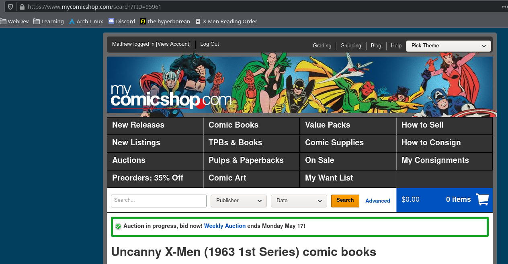

# mycomicshop_tracker

A python application that scrapes current prices for any user-specified comics and returns them as json objects.

### To track a volume:
1. Get the volume id from the mycomicshop.com website (the number listed after TID in the url in the image below).
2. Add that volume id to issue_tracking.json in the "volumes" section.

### To track an issue:
1. Get the issue id from the mycomicshop.com website, or run this application on the volume id.  Each issue object that is returned will contain that issue's specific id.
2. Add that issue id to issue_tracking.json in the "singles" section.
